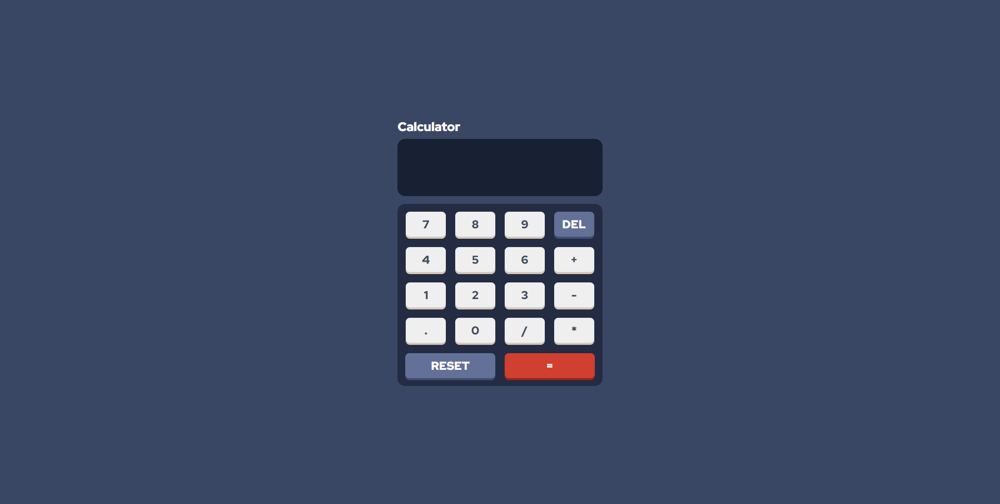

# 📱 Responsive Calculator

This project is a Simple Responsive Calculator.

  

 

# 🚀 Technologies

This project was developed with the following technologies:

- HTML
- CSS
- JavaScript

Library

- [Google Fonts](https://fonts.google.com/)

 

## 💻 Project

This project was taken from the website Frontend Mentor, where I was able to make some changes to my liking.

- [Frontend Mentor](https://www.frontendmentor.io/home)
